<p align="center"></p>

<p align="center">
  Zexi Zhang<sup>*</sup>, Zecheng Zhu<sup>*</sup>, Zidong Chen, Zulkhuu Tuya, Stephen James<br>
  Department of Computing, Imperial College London<br>
  <sub><sup>*</sup>Equal contribution</sub>
</p>

<p align="center">
  <a href="https://arxiv.org/abs/2610.07594"></a>
  <a href="https://huggingface.co/datasets/SWIRL-Lab/bigym-g1-native60"></a>
  <a href="https://github.com/astral-sh/uv"></a>
  <a href="https://www.python.org/"></a>
  <a href="LICENSE"></a>
</p>

**BiGym 2.0** brings [BiGym](https://github.com/NeuracoreAI/bigym) to a walking humanoid. A Unitree G1 performs 20 household tasks while NVIDIA's frozen GR00T-WBC policy keeps it balanced and walking inside every environment step. The same controller is used for VR data collection, training and evaluation.

<p align="center"></p>

- **20 tasks** across reaching, table-top, dishwasher and kitchen-counter scenes.
- **60 human VR demonstrations per task**, with full simulator state so every frame can be re-rendered.
- **One evaluation protocol**: 100 fixed seeds, bit-exact replay, and results stamped with a physics fingerprint.
- **Learned policies and coding agents** are scored through the same observation and action interface.

## Installation

```bash
curl -LsSf https://astral.sh/uv/install.sh | sh     # uv, if you don't have it yet
git clone https://github.com/swirl-uk/BiGym2.git && cd BiGym2
uv sync --extra agent
```

This installs the environments, the GR00T-WBC lower body, the demonstration loader, the evaluation protocol and the coding-agent benchmark. The GR00T-WBC weights ship with the package and run on onnxruntime, so there is no torch dependency. For a minimal install, VR teleoperation or LeRobot export, see [Getting started](docs/getting_started.md#install).

## Tasks

The benchmark has 20 tasks in four scene groups: reaching, table-top, dishwasher and kitchen counter.

<details>
<summary><b>All 20 tasks</b>: instructions and source</summary>
<br>

<table>
<tr><th colspan="3" align="left">Reaching</th></tr>
<tr><td><a href="bigym/envs/reach_target.py"><code>reach_target_single</code></a></td><td>Reach the target with the left wrist.</td><td>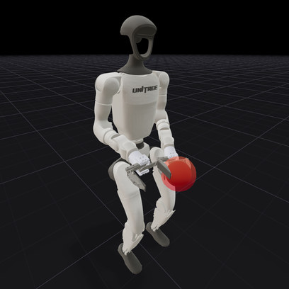</td></tr>
<tr><td><a href="bigym/envs/reach_target.py"><code>reach_target_multi_modal</code></a></td><td>Reach the target with either wrist.</td><td>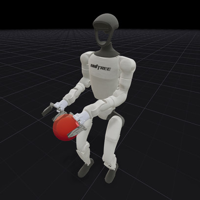</td></tr>
<tr><td><a href="bigym/envs/reach_target.py"><code>reach_target_dual</code></a></td><td>Reach the two targets, one with each wrist.</td><td>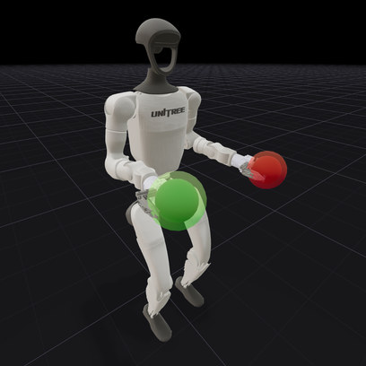</td></tr>
<tr><th colspan="3" align="left">Table-top</th></tr>
<tr><td><a href="bigym/envs/move_plates.py"><code>move_plate</code></a></td><td>Move the plate between two draining racks.</td><td>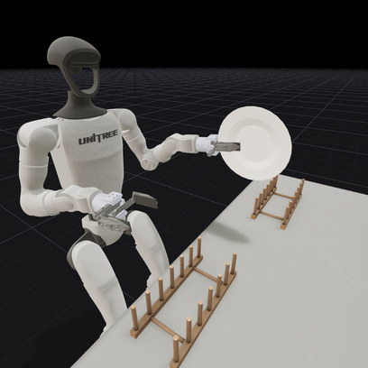</td></tr>
<tr><td><a href="bigym/envs/move_plates.py"><code>move_two_plates</code></a></td><td>Move two plates simultaneously from one draining rack to the other.</td><td>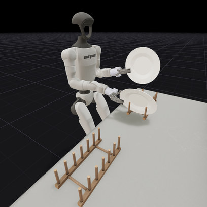</td></tr>
<tr><td><a href="bigym/envs/manipulation.py"><code>flip_cup</code></a></td><td>Flip the upside-down cup to an upright position.</td><td>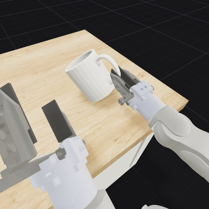</td></tr>
<tr><td><a href="bigym/envs/manipulation.py"><code>flip_cutlery</code></a></td><td>Take the cutlery from the holder, flip it, and place it back.</td><td>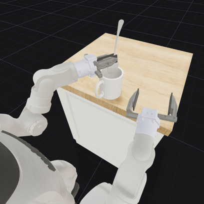</td></tr>
<tr><td><a href="bigym/envs/manipulation.py"><code>stack_blocks</code></a></td><td>Move blocks across the table and stack them in the target area.</td><td>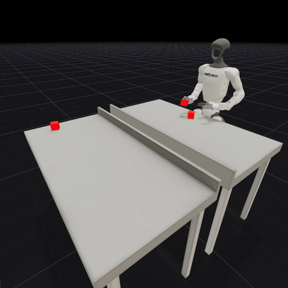</td></tr>
<tr><th colspan="3" align="left">Dishwasher</th></tr>
<tr><td><a href="bigym/envs/dishwasher.py"><code>dishwasher_close</code></a></td><td>Push back all trays and close the door of the dishwasher.</td><td>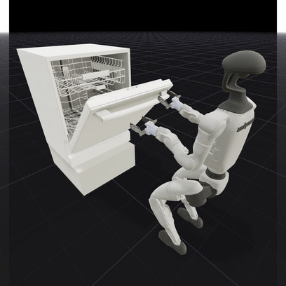</td></tr>
<tr><td><a href="bigym/envs/dishwasher_cups.py"><code>dishwasher_load_cups</code></a></td><td>Move the cups from the table into the dishwasher's upper tray.</td><td>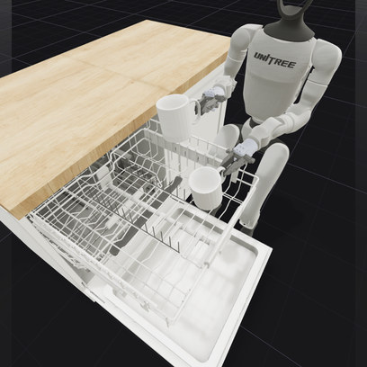</td></tr>
<tr><td><a href="bigym/envs/dishwasher_cutlery.py"><code>dishwasher_load_cutlery</code></a></td><td>Move the cutlery from the holder on the table into the dishwasher's cutlery basket.</td><td>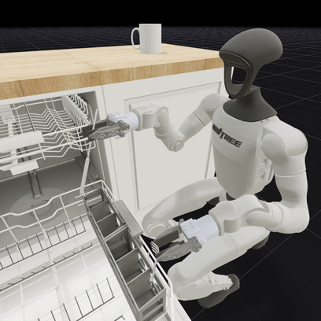</td></tr>
<tr><td><a href="bigym/envs/dishwasher_plates.py"><code>dishwasher_load_plates</code></a></td><td>Move the plates from the rack into the dishwasher's lower tray.</td><td>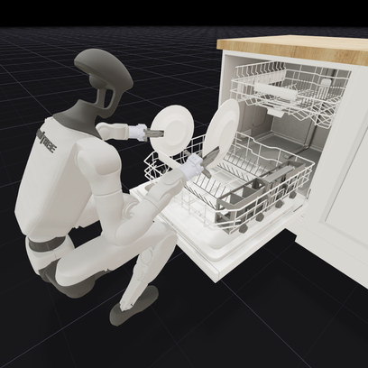</td></tr>
<tr><th colspan="3" align="left">Kitchen counter</th></tr>
<tr><td><a href="bigym/envs/cupboards.py"><code>drawer_top_open</code></a></td><td>Open the top drawer of the kitchen cabinet.</td><td>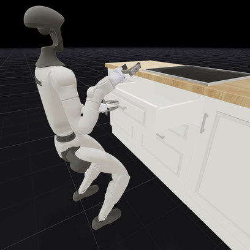</td></tr>
<tr><td><a href="bigym/envs/cupboards.py"><code>drawer_top_close</code></a></td><td>Close the top drawer of the kitchen cabinet.</td><td>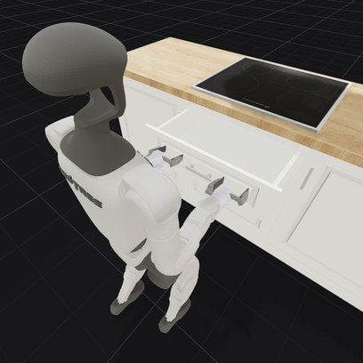</td></tr>
<tr><td><a href="bigym/envs/pick_and_place.py"><code>pick_box</code></a></td><td>Pick up the box from the side table and place it on the counter.</td><td>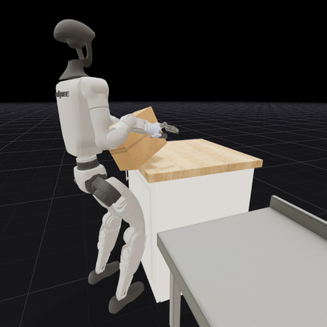</td></tr>
<tr><td><a href="bigym/envs/pick_and_place.py"><code>put_cups</code></a></td><td>Pick up the cups from the table and put them into the closed wall cabinet.</td><td>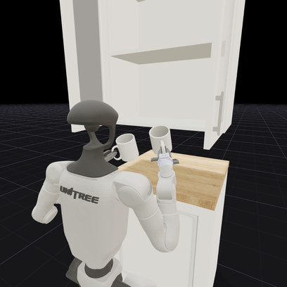</td></tr>
<tr><td><a href="bigym/envs/pick_and_place.py"><code>saucepan_to_hob</code></a></td><td>Take the saucepan from the closed cabinet and place it on the hob.</td><td>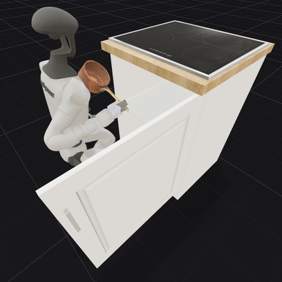</td></tr>
<tr><td><a href="bigym/envs/pick_and_place.py"><code>sandwich_remove</code></a></td><td>Remove the sandwich from the frying pan.</td><td>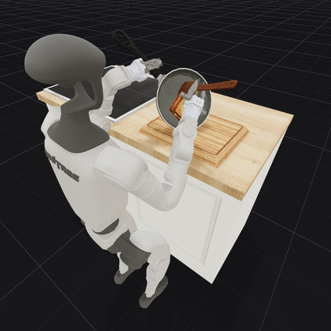</td></tr>
<tr><td><a href="bigym/envs/cupboards.py"><code>wall_cupboard_open</code></a></td><td>Open the doors of the wall cabinet.</td><td>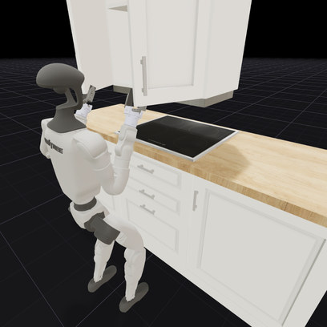</td></tr>
<tr><td><a href="bigym/envs/cupboards.py"><code>wall_cupboard_close</code></a></td><td>Close the doors of the wall cabinet.</td><td>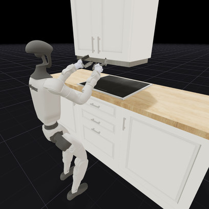</td></tr>
</table>
</details>

The demonstrations are on Hugging Face at [`SWIRL-Lab/bigym-g1-native60`](https://huggingface.co/datasets/SWIRL-Lab/bigym-g1-native60), one LeRobot v3 dataset per task. `env.get_demos()` downloads a task's demonstrations the first time it is called; to fetch them ahead of time:

```bash
uv run bigym-download --list                            # published tasks
uv run bigym-download --task move_plate pick_box        # just these tasks
uv run bigym-download --all                             # every task
```

Both use the Hugging Face cache (`~/.cache/huggingface`), so nothing is downloaded twice; details in [Getting the demonstrations](docs/demos_eval.md#getting-the-demonstrations).

To watch them, `uv run bigym-view` opens a browser viewer with a task dropdown (`--task move_plate` picks the first one). `bigym-download --local-dir PATH` downloads into a folder instead of the cache, and `bigym-view --demo-dir PATH` (or the viewer's *Demo directory* panel, a folder browser) opens it.

## Coding-agent benchmark

<p align="center">
  <picture>
    <source media="(prefers-color-scheme: dark)" srcset="https://bigym2.github.io/readme/agent_protocol_dark.gif">
    
  </picture>
</p>

A coding agent gets a one-sentence task description, a video of one human demonstration and 101k environment steps. It writes `policy.py` by hand, and the program is then scored on the same 100 hidden seeds as the learned policies.

```bash
export OPENAI_API_KEY=<your-key>
uv run bigym-agent run --task move_plate --harness codex --model <model-id>
```

The harness runs in Docker, so the host only needs Docker, ffmpeg and an API key (`OPENAI_API_KEY`, or `ANTHROPIC_API_KEY` with `--harness claude`). See [docs/agent.md](docs/agent.md) for setup.

## Documentation

| Guide | Contents |
|---|---|
| [Getting started](docs/getting_started.md) | First environment, action layout, demonstrations |
| [Tasks](docs/tasks.md) | Success conditions, reset randomisation, episode budgets |
| [Evaluation protocol](docs/official_configuration.md) | Official configuration, seeds, result records |
| [Coding-agent benchmark](docs/agent.md) | Sandbox, harnesses, scoring |
| [Demo collection](docs/demo_collection.md) | Recording your own VR demonstrations |
| [Building on BiGym](docs/extending.md) | Your own tasks and controllers in a separate package |

## Roadmap

- [ ] WebXR teleoperation, so demonstrations can be collected from macOS, Apple Vision Pro or the Quest browser
- [ ] PyPI release
- [ ] Public leaderboard

## Citation

```bibtex
@article{zhang2026bigym2,
  title   = {BiGym 2.0: Benchmarking Learned and Agent-Developed Policies for Humanoid Household Manipulation},
  author  = {Zhang, Zexi and Zhu, Zecheng and Chen, Zidong and Tuya, Zulkhuu and James, Stephen},
  journal = {arXiv preprint arXiv:2610.07594},
  year    = {2026}
}
```

BiGym 2.0 builds on [BiGym](https://arxiv.org/abs/2407.07788); please consider citing it as well:

```bibtex
@article{chernyadev2024bigym,
  title   = {BiGym: A Demo-Driven Mobile Bi-Manual Manipulation Benchmark},
  author  = {Chernyadev, Nikita and Backshall, Nicholas and Ma, Xiao and Lu, Yunfan and Seo, Younggyo and James, Stephen},
  journal = {arXiv preprint arXiv:2407.07788},
  year    = {2024}
}
```

## License

The code is released under the [Apache 2.0 License](LICENSE). Bundled third-party components keep their own licenses:

- **Robot model**: the Unitree G1 description (BSD-3-Clause), in the MuJoCo packaging of [AMO](https://github.com/OpenTeleVision/AMO) (Apache-2.0); see [`bigym/envs/xmls/g1/`](bigym/envs/xmls/g1/).
- **Scene props** are CC0 or CC BY 4.0; see [the attributions](bigym/envs/xmls/3D_MODELS_ATTRIBUTION.md).
- **GR00T-WBC weights** are NVIDIA's, redistributed under the NVIDIA Open Model License; see [`NOTICE`](NOTICE) and [`THIRD_PARTY_NOTICES.md`](THIRD_PARTY_NOTICES.md).

## Acknowledgements

BiGym 2.0 builds on [BiGym](https://github.com/NeuracoreAI/bigym) by Chernyadev et al. The lower-body controller is NVIDIA's [GR00T-WBC](https://github.com/NVlabs/GR00T-WholeBodyControl).
